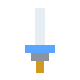
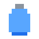
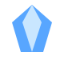
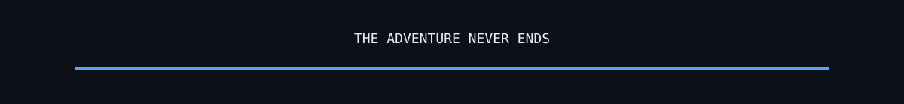

<div align="center">


# CONJURADOR 

### `PIXEL ARTIST` • `GAME DESIGNER` • `DEVELOPER IN PROGRESS`


</div>

## 🕹️ PLAYER PROFILE

```text
╔══════════════════════════════════════════════════════════╗
║                    PLAYER STATUS                         ║
╠══════════════════════════════════════════════════════════╣
║                                                          ║
║  NAME       Conjurador Thomas                            ║
║  CLASS      Pixel Artist / Game Developer                ║
║  SPECIALTY  2D • Pixel Art • UI • Game Development       ║
║  CURRENT    Building worlds one pixel at a time...       ║
║                                                          ║
║  HP         ████████████████████  100%                   ║
║  MANA       ███████████████░░░░░   76%                   ║
║  XP         ████████████░░░░░░░░   61%                   ║
║                                                          ║
╚══════════════════════════════════════════════════════════╝
```

> 🎨 I create pixel art, game interfaces, characters and worlds — while learning the code behind them.

---

## ⚔️ SKILL TREE

<div align="center">

| 🎨 ART | 💻 CODE | 🎮 GAME DEV |
|:---:|:---:|:---:|
| Pixel Art | HTML / CSS | 2D Games |
| Aseprite | Photoshop | Illustrator |
| Python |

</div>

---

## 🗺️ ACTIVE QUESTS

### 🏰 Kingdom of Pixels

> **2D platform MOBA / multiplayer game**

A pixel-art game project where art, UI, gameplay and programming come together.

**Quest objectives:**

- [x] Pixel-art characters and assets
- [x] Game UI concepts
- [x] Shop / cosmetics concepts
- [x] Chat interface
- [x] Translation interface
- [ ] Expand gameplay systems
- [ ] Continue improving multiplayer infrastructure

---

### 🧪 Learning the Arcane Arts

Currently leveling up my programming skills.

```text
PYTHON       █████████░░░░░░░░░░░  Basic → Intermediate
JAVASCRIPT   ████████░░░░░░░░░░░░  Learning
TYPESCRIPT   ██████░░░░░░░░░░░░░░  Learning
VUE          ██████░░░░░░░░░░░░░░  Learning
NODE.JS      ██████░░░░░░░░░░░░░░  Learning
```

---

## 🎒 INVENTORY

<div align="center">


&nbsp;&nbsp;&nbsp;

&nbsp;&nbsp;&nbsp;


</div>

```text
┌──────────────────────────────────────────────────────────┐
│ INVENTORY                                                │
├──────────────────────────────────────────────────────────┤
│ 🗡️  Pixel Art       ████████████████████ Equipped        │
│ 🧪  Game Design     ███████████████░░░░░ Equipped         │
│ 💎  UI Design       ████████████████░░░ Equipped          │
│ 📜  Programming     ████████░░░░░░░░░ Equipped            │
│ 🛡️  Problem Solving █████████████████░ Equipped           │
└──────────────────────────────────────────────────────────┘
```

---

## 🧰 TECHNOLOGIES

<div align="center">


</div>

---

## 📜 GUILD LOG

```text
[2026] ████████████████████  Learning + Building
[2025] ███████████████░░░░░  Game / Art Projects
[2024] █████████████░░░░░░░  Pixel Art
[....] ████████████████████  Next adventure...
```

---

## 📊 BATTLE STATS

<div align="center">


</div>

---

## 🐍 THE ENDLESS QUEST

<div align="center">


</div>

---

<div align="center">



### `INSERT COIN TO CONTINUE`

**Thanks for visiting my profile!** ⭐

</div>
