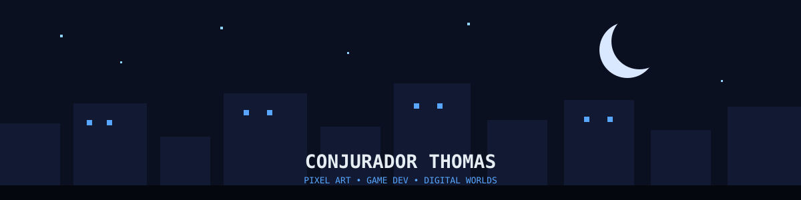
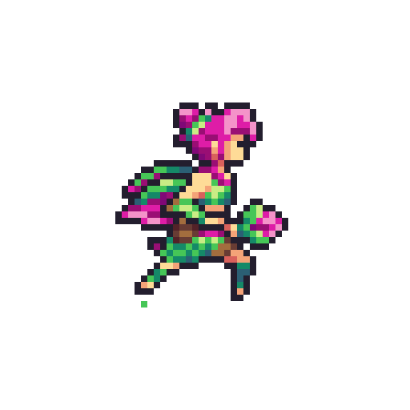

<div align="center">



</div>
--------
```text

</pre>
<!-- [](http://linkedin.com/in/ingridrosselis) -->
<!-- [](https://tech.lgbt/@innng) -->
[](https://osu.ppy.sh/users/4606212)
[](https://enka.network/u/Inng/1A4HU1/10000069/1985924/)
<!-- [](http://linkedin.com/in/ingridrosselis) -->
<!-- [](https://tech.lgbt/@innng) -->
[](https://osu.ppy.sh/users/4606212)
[](https://enka.network/u/Inng/1A4HU1/10000069/1985924/)
<!-- [](http://linkedin.com/in/ingridrosselis) -->
<!-- [](https://tech.lgbt/@innng) -->
[](https://osu.ppy.sh/users/4606212)
[](https://enka.network/u/Inng/1A4HU1/10000069/1985924/)
</div>
```

<div align="center">

<br> <table> <tr> <td width="45%" align="center" valign="top">  </td> <td width="55%" align="center" valign="top">

 ✦ SKILLS ✦ 
|  ART |  CODE |  GAME DEV |
|:---:|:---:|:---:|
| Aseprite | HTML / CSS | 2D Games |
| Photoshop | Python |
| Illustrator |
| Figma |

</td> </tr> </table> <br> 

</div>